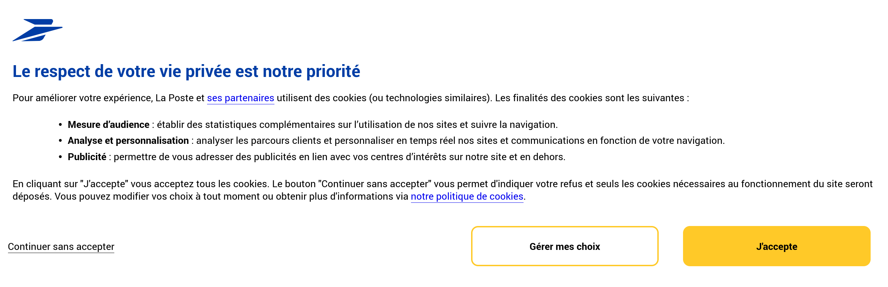

# Rapport – Étape 2.1 : Bannière de cookies conforme RGPD

## Objectif

Expliquer les principes du RGPD liés aux cookies, rappeler les bonnes pratiques pour une bannière conforme, et fournir un exemple observé sur un site tiers.

---

## 1. Les 7 principes fondamentaux du RGPD (Article 5)

### 1. Licéité, loyauté et transparence
Les données doivent être collectées de manière :
- **licite** (avec une base légale),
- **loyale** (sans tromperie),
- **transparente** (informations compréhensibles).

### 2. Limitation des finalités
Les données doivent être collectées pour des **finalités claires, explicites et légitimes**.

### 3. Minimisation des données
Ne collecter que les **données strictement nécessaires**.

### 4. Exactitude des données
Les données doivent être **exactes** et **mises à jour**.

### 5. Limitation de la conservation
Les données doivent être conservées **uniquement le temps nécessaire**.

### 6. Intégrité et confidentialité
Des mesures doivent garantir la **sécurité** des données (accès, perte, destruction).

### 7. Responsabilité (Accountability)
Le responsable doit **prouver** le respect des principes RGPD.

---

## 2. Acceptation des cookies via une bannière conforme

Une bannière de cookies conforme doit :
- Expliquer clairement les **finalités** (publicité, statistiques, etc.)
- Offrir **Accepter** et **Refuser** (ou gestion granulaire)
- Ne pas précocher les cases : le consentement doit être **actif**
- Permettre la **modification à tout moment**
- Ne pas bloquer l’accès si aucun choix n’est fait

**Attention :** Une bannière avec uniquement « OK » n’est pas conforme.

---

## 3. Cookies strictement nécessaires et session

Les **cookies strictement nécessaires** ne nécessitent **pas de consentement**.

Exemples :
- Session utilisateur (auth, sécurité)
- Panier d’achat
- Langue / accessibilité

### Exemple session en Node.js :

```js
app.use(session({
  name: 'session_id',
  secret: 'secret123',
  resave: false,
  saveUninitialized: false,
  cookie: {
    httpOnly: true,
    secure: false,
    maxAge: 1800000 // 30 min
  }
}));
```

---

## 4. Exemple d’un site conforme

Voici un exemple réel de bannière conforme, observée sur un site tiers comme **La Poste** (`https://laposte.fr/`).




Cette bannière respecte les exigences :
- Informations claires
- Boutons « Accepter » et « Refuser »
- Bouton de la gestion des préférences

---

## Conclusion

- Le RGPD impose des règles strictes sur les cookies non essentiels
- La transparence, le choix et le contrôle sont essentiels
- Une bannière conforme améliore la confiance et la conformité légale
