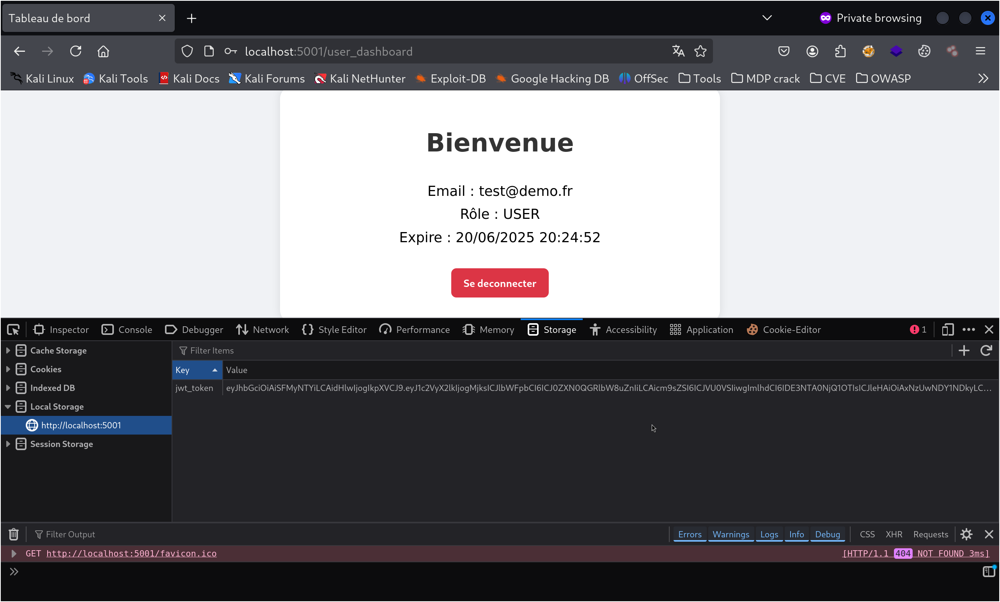
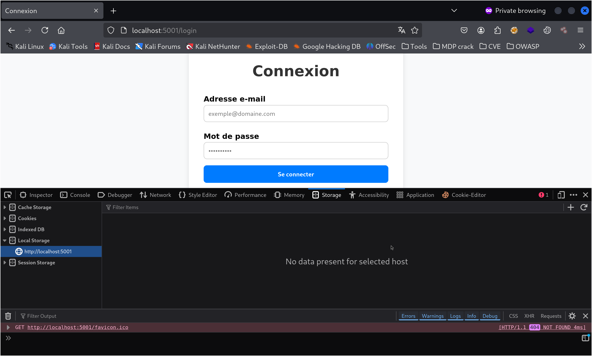
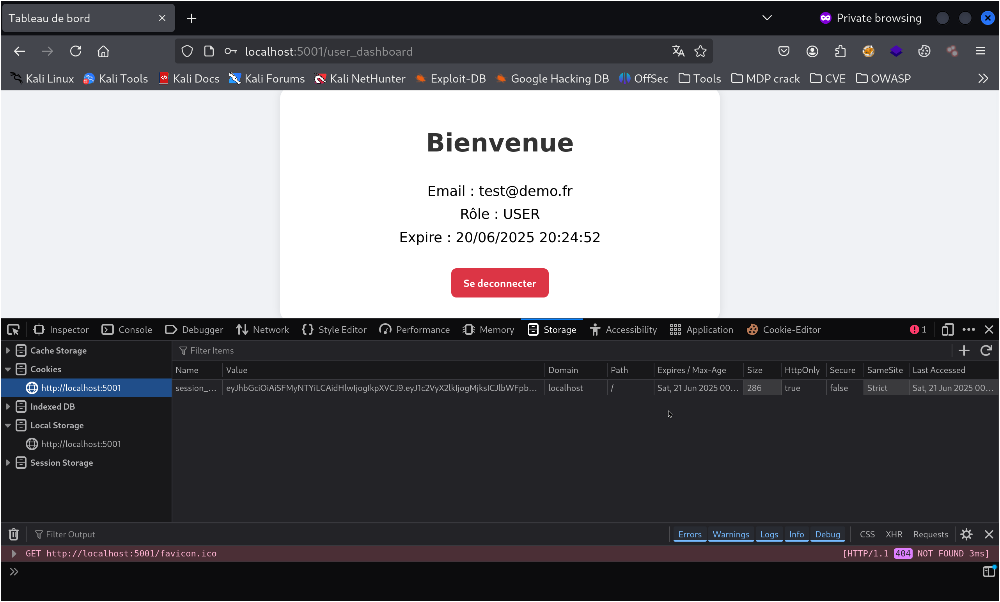

# Rapport de vérification – Étape 2.3 : JWT côté frontend (localStorage)

## Objectif

Permettre à l’application frontend :

- de recevoir un token JWT signé côté backend
- de le stocker dans le navigateur (`localStorage`)
- de le réutiliser dans les appels sécurisés
- de le supprimer à la déconnexion ou expiration

Ce mécanisme complète le cookie `HttpOnly` déjà mis en place en 2.2.

---

## Différence : Cookie `HttpOnly` vs `localStorage`

| Cookie HttpOnly                             | localStorage                                 |
|---------------------------------------------|----------------------------------------------|
| Envoyé automatiquement par le navigateur    | Doit être transmis manuellement (`Authorization: Bearer`) |
| Invisible en JavaScript (anti-XSS)          | Lisible/modifiable en JS (risque XSS si mal protégé)     |
| Expire automatiquement (`max-age`)          | Nécessite suppression explicite (logout JS)  |
| Parfait pour les sessions classiques        | Adapté aux applications SPA avec frontend JS |

-> Dans ce projet, on utilise les deux :  
- [✔] Cookie `HttpOnly` sécurisé (2.2)  
- [✔] Stockage `localStorage` + envoi manuel du JWT (2.3)

---

## Étapes validées

- [✔] Route `/api/login-json` génère un JWT côté serveur
- [✔] Le JWT est renvoyé en JSON dans la réponse
- [✔] Le JavaScript le stocke dans `localStorage.jwt_token`
- [✔] Le token est utilisé manuellement via `Authorization: Bearer`
- [✔] Il est supprimé par JS à la déconnexion ou expiration

---

## Captures de vérification

Token stocké dans le navigateur après connexion :



Token supprimé après déconnexion ou expiration :



Cookie RGPD toujours présent (provenant de 2.2) :



---

## Test manuel recommandé (navigateur)

1. Lancer le serveur : `bash web/load_env_conf.sh start web.app_2_3` depuis le répertoire racine du projet `RGPDapp`
2. Ouvrir le navigateur sur : `http://localhost:5001/login`
3. Se connecter avec un compte valide (ex. : `test@demo.fr / Secure123!Test`)
4. Aller dans l’onglet DevTools > Stockage > LocalStorage
  -> Vérifier que `jwt_token` est bien présent
5. Aller sur : `http://localhost:5001/user_dashboard`
  -> L’accès doit être autorisé avec le JWT
6. Se déconnecter (bouton) ou attendre 65 secondes
  -> Le `jwt_token` doit être supprimé du **localStorage**
7. Arrêter le serveur depuis le répertoire racine du projet `RGPDapp` : `bash web/load_env_conf.sh stop`

---

## Tests automatisés disponibles

Dossier : `web/tests/api/2.3/`

### `test_2_3_1_jwt_gen.sh`

- Vérifie que le backend génère un JWT valide
- Vérifie que le token est bien renvoyé et utilisable

### `test_2_3_2_jwt_stockage.sh`

- Simule l’usage du frontend :
  - récupère le token
  - appelle `/api/user/dashboard` avec ce token

---

## Arborescence du dossier `2.3`

```
web/tests/api/2.3/
├── img/
│   ├── localStorage_apres_login.png
│   ├── localStorage_apres_expiration_deconnexion.png
│   └── cookies_apres_login.png
├── test_2_3_1_jwt_gen.sh
├── test_2_3_2_jwt_stockage.sh
└── rapport_2_3.md
```

---

## Conclusion

- Le JWT est bien généré côté serveur
- Il est envoyé en JSON, stocké côté client (`localStorage`)
- Il peut être utilisé dans des requêtes sécurisées (`Authorization: Bearer`)
- Il est supprimé manuellement à la déconnexion ou expiration
- Ce comportement est conforme au RGPD (en complément du cookie `HttpOnly`)

[✔] Étape 2.3 validée : sécurité, conformité et fonctionne.
